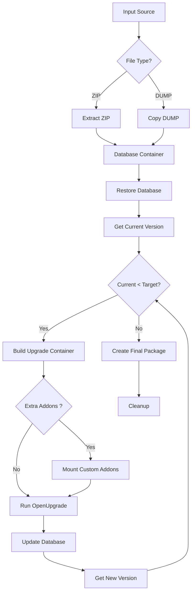

# OdooUpgrader
[]()
[](https://www.python.org/downloads/)
[](https://www.docker.com/)
[](https://pepy.tech/project/odooupgrader)


Professional command-line tool for automating Odoo database upgrades using [OCA's OpenUpgrade](https://github.com/OCA/OpenUpgrade) framework. Seamlessly upgrade your Odoo databases from version 10.0 through 18.0 with a single command.

## ✨ Features

- **🚀 Automated Incremental Upgrades**: Automatically handles multi-step upgrades
- **📦 Multiple Source Formats**: Supports both `.zip` and `.dump` database files
- **🌐 Remote Downloads**: Download databases directly from URLs
- **🔌 Custom Addons Support**: Include custom Odoo modules during the upgrade process
- **🐳 Docker-Based**: Uses containerized environments for safe, isolated upgrades
- **📊 Rich CLI Output**: Beautiful progress bars and status indicators using Rich library
- **📝 Detailed Logging**: Optional verbose mode and log file support
- **✅ Validation**: Pre-flight checks for source accessibility and Docker availability

## 📋 Requirements

- **Python**: 3.9 or higher
- **Docker**: Docker Engine with Docker Compose (v2) or docker-compose (v1)
- **Operating System**: Linux, macOS, or Windows (with WSL2 for best results)
- **Disk Space**: Minimum 5GB free space for Docker volumes and temporary files

## 🚀 Installation

### Using pip (Recommended)

```bash
pip install odooupgrader
```

### From Source

```bash
git clone https://github.com/fasilwdr/OdooUpgrader.git
cd OdooUpgrader
pip install -e .
```

## 📖 Usage

### Basic Usage

Upgrade a local database file to version 16.0:

```bash
odooupgrader --source /path/to/database.zip --version 16.0
```

### Download and Upgrade from URL

```bash
odooupgrader --source https://example.com/database.dump --version 17.0
```

### Upgrade with Custom Addons

Include custom addons from a local directory:

```bash
odooupgrader --source /path/to/database.zip --version 16.0 --extra-addons /path/to/custom_addons
```

Include custom addons from a local ZIP file:

```bash
odooupgrader --source /path/to/database.zip --version 16.0 --extra-addons /path/to/addons.zip
```

Include custom addons from a remote ZIP URL:

```bash
odooupgrader --source /path/to/database.zip --version 16.0 --extra-addons https://example.com/custom_addons.zip
```

### Specify PostgreSQL Version

```bash
odooupgrader --source /path/to/database.zip --version 16.0 --postgres-version 15
```

### Enable Verbose Logging

```bash
odooupgrader --source /path/to/database.zip --version 18.0 --verbose
```

### Save Logs to File

```bash
odooupgrader --source /path/to/database.zip --version 15.0 --log-file upgrade.log
```

### Complete Example with All Options

```bash
odooupgrader \
  --source https://example.com/database.dump \
  --version 17.0 \
  --extra-addons https://example.com/custom_modules.zip \
  --postgres-version 15 \
  --verbose \
  --log-file upgrade.log
```

## 🎯 Command-Line Options

| Option | Required | Description |
|--------|----------|-------------|
| `--source` | ✅ | Path to local `.zip`/`.dump` file or URL to download |
| `--version` | ✅ | Target Odoo version (10.0, 11.0, 12.0, 13.0, 14.0, 15.0, 16.0, 17.0, 18.0) |
| `--extra-addons` | ❌ | Custom addons location: local folder, local `.zip` file, or URL to `.zip` file |
| `--postgres-version` | ❌ | PostgreSQL version for the database container (default: 13) |
| `--verbose` | ❌ | Enable verbose logging output |
| `--log-file` | ❌ | Path to save detailed log file |

## 📄 How It Works

1. **Validation**: Checks if source file/URL is accessible and Docker is available
2. **Environment Setup**: Creates necessary directories and PostgreSQL container
3. **Source Processing**: Downloads (if URL) and extracts the database
4. **Addons Processing**: Downloads and extracts custom addons (if provided)
5. **Database Restoration**: Restores database and filestore to PostgreSQL
6. **Version Detection**: Determines current database version
7. **Incremental Upgrades**: Runs OpenUpgrade for each version step with custom addons
8. **Package Creation**: Creates final `.zip` with upgraded database and filestore

## 📁 Output Structure

After successful upgrade, you'll find in the `output` directory:

```
output/
├── upgraded.zip          # Final packaged database (ready to restore)
└── odoo.log             # Upgrade process logs
```

## 🏗 Architecture



## 🔧 Custom Addons

The `--extra-addons` option allows you to include custom Odoo modules during the upgrade process. This is essential when your database uses custom addons that need to be available during migration.

### Supported Formats

- **Local Directory**: `--extra-addons /path/to/custom_addons`
- **Local ZIP File**: `--extra-addons /path/to/addons.zip`
- **Remote ZIP URL**: `--extra-addons https://example.com/custom_modules.zip`

### Directory Structure

```
custom_addons/
├── requirements.txt       # Optional: Python dependencies for your addons
├── module_1/
│   ├── __init__.py
│   └── __manifest__.py
├── module_2/
│   ├── __init__.py
│   └── __manifest__.py
```

**Note**: If your custom addons require additional Python packages, include a `requirements.txt` file in the root directory. Dependencies will be automatically installed during the upgrade process.

## 📚 Supported Versions

This tool supports upgrading Odoo databases from version 10.0 through 18.0. The upgrade paths and compatibility are determined by the [OCA OpenUpgrade project](https://github.com/OCA/OpenUpgrade), which maintains migration scripts for each Odoo version.

## 🤝 Contributing

Contributions are welcome!

## 🔒 Security Considerations

- Database credentials are hardcoded for the temporary Docker container
- The PostgreSQL container is on an isolated Docker network
- No ports are exposed to the host machine
- Containers are automatically cleaned up after upgrade
- Consider using this tool in isolated environments for production databases

## 📄 License

This project is licensed under the MIT License - see the [LICENSE](LICENSE) file for details.

## 🙏 Acknowledgments

- [OCA (Odoo Community Association)](https://odoo-community.org/) for the OpenUpgrade framework
- [OpenUpgrade Project](https://github.com/OCA/OpenUpgrade) for migration scripts

## 📞 Support

- **Issues**: [GitHub Issues](https://github.com/fasilwdr/OdooUpgrade/issues)
- **Email**: fasilwdr@hotmail.com

## 📈 Changelog

### Version 0.2.0

- ✨ Added custom addons support via `--extra-addons` option
- 📦 Support for local directories, local ZIP files, and remote ZIP URLs
- 🔌 Automatic addon mounting during upgrade process
- 🎯 Enhanced upgrade workflow with custom module integration

### Version 0.1.0 (Initial Release)

- ✨ Initial release with core upgrade functionality
- ✅ Support for Odoo versions 10.0 through 18.0
- 🐳 Docker-based isolated upgrade environment
- 📊 Rich CLI output with progress indicators
- 🌐 URL download support for remote databases
- 📦 Automatic packaging of upgraded databases

---

**Made with ❤️ by Fasil | Powered by OpenUpgrade**

⭐ If you find this tool helpful, please star the repository!